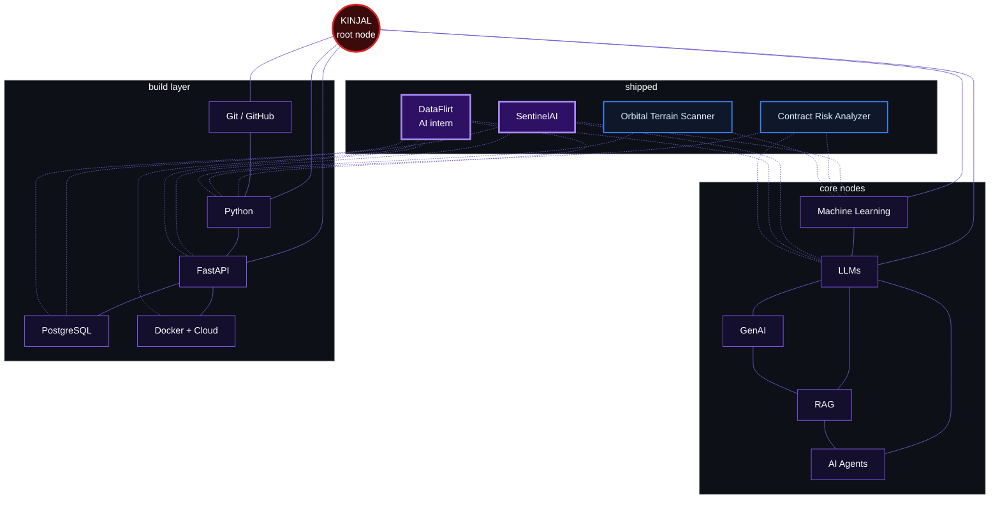

<div align="center">

</div>

<br/>

## > crawl.status

```text
identity   : from future import ML_Engineer
me = ML_Engineer(stack=["torch", "sklearn"])
session    : AI Intern @ DataFlirt · Bangalore
mode       : building practical AI systems, in public
interests  : Machine Learning · LLMs · GenAI · RAG · AI Agents · AI data systems
learning   : ML engineering · production AI · LLM cost and quality
contributes: open source
```


## > currently_crawling

| Target | Status | Why it matters |
|:--|:--|:--|
| ML engineering | `indexing` | Training is the easy part. Evaluation, deployment and monitoring are what make a model useful. |
| RAG + agents | `indexing` | Retrieval quality and tool use decide whether LLM apps are reliable. |
| Self-healing data pipelines | `crawling` | AI systems are only as good as the data they are fed, and that data keeps changing. |
| LLM cost discipline | `crawling` | Measuring tokens and cost per run turns a demo into something you can operate. |


## > the_web

Every node is a skill, and every thread is a place I used it. The projects sit at the edge of the web, where the skills connect.



<div align="center">


</div>


## > active_session: DataFlirt

```text
$ crawl --session active

role    : AI Intern
org     : DataFlirt · Bangalore, India
mission : build and run the data systems that feed AI
```

| Workstream | What I build |
|:--|:--|
| Self-healing data agents | Async Python crawlers with a versioned selector registry, drift detection, and automated repair that promotes a fix or rolls it back |
| Data layer for AI | Relational schemas, indexing, deduplication and replayable raw-payload archives |
| Low-latency APIs | FastAPI services with caching, pagination and measured p50/p95 response times |
| Cloud deployment | Containers, scheduled jobs and queues on AWS or GCP |
| LLM cost discipline | Measured tokens and cost per run wherever LLMs are used |

`Python` · `asyncio` · `httpx / aiohttp` · `Playwright` · `FastAPI` · `PostgreSQL` · `pydantic` · `pytest` · `Docker` · `AWS / GCP`


## > featured_node: SentinelAI

<table>
<tr>
<td width="60%" valign="top">

**Production LLM quality-monitoring system.**

SentinelAI watches an LLM application in production and flags quality drift before users notice. Responses are embedded with TF-IDF and scored with **Isolation Forest** and **CUSUM** change detection. Anomalies trigger **Slack webhook** alerts.

`FastAPI` · `Supabase Postgres` · `Render` · `Isolation Forest` · `CUSUM` · `Slack alerts`

[**Repository**](https://github.com/KinjalGoswami68/-SentinelAI) · [**Live demo**](https://sentinelai24455.streamlit.app/)

</td>
<td width="40%" align="center" valign="middle">

<a href="https://github.com/KinjalGoswami68/YOUR_SENTINELAI_REPO">

</a>

</td>
</tr>
</table>


## > other_nodes

<table>
<tr>
<td width="50%" valign="top">

**Contract Risk Analyzer**

DistilBERT fine-tuned on the CUAD dataset to classify contract clauses across 34 risk categories (~75% accuracy). Llama 3.3 70B on Groq explains each flagged clause in plain English. The frontend is Streamlit.

`DistilBERT` · `CUAD` · `Groq` · `Streamlit`

[Repository](https://github.com/KinjalGoswami68/contract-risk-analyzer)

</td>
<td width="50%" valign="top">

**Orbital Terrain Scanner**

[1-2 lines: what it scans, what data or imagery it uses, and what it outputs.]

`[tech]` · `[tech]` · `[tech]`

[Repository](https://github.com/KinjalGoswami68/terrain-web-app)

</td>
</tr>
<tr>
<td colspan="2" valign="top">

**More threads**

Smaller experiments, notebooks and builds live in my repositories. [Browse all repositories](https://github.com/KinjalGoswami68?tab=repositories)

</td>
</tr>
</table>


## > open_source_threads

<table>
<tr>
<td valign="top">

**HonmaruAI: Web Client Auth & Real-Time Sync**

August 2026 · Cloudflare Workers · [Merged PR #10](https://github.com/Torutesu/HonmaruAI/pull/10)

- Turned the reference web client into a real signed-in client: session-token auth, a browser create/decide flow reaching the WebSocket relay, and a CORS fix that unblocked all browser API calls.
- Iterated through multiple rounds of maintainer review, closing authorization gaps the review surfaced (org-membership checks, invite-role validation, identity uniqueness) and adding a test for each fix before merge.

</td>
</tr>
<tr>
<td valign="top">

**arkor: CLI Port-Fallback Fix**

[Merged PR](https://github.com/arkorlab/arkor/issues/199)

- Diagnosed and fixed a port-fallback bug in the `arkor dev` CLI command, taking the fix through multiple rounds of maintainer code review before it was merged into main.

</td>
</tr>
</table>


## > telemetry

<div align="center">


</div>


## > frontier_nodes

```text
[queued]  LLM evaluation + observability     (taking SentinelAI further)
[queued]  Agent workflows and tool use
[queued]  Retrieval quality in RAG systems
[active]  Cost-aware LLM systems             (tokens and cost per run)
```

## > open_connection

<div align="center">

<a href="https://www.linkedin.com/in/kinjal-goswami-03738a376"></a>
<a href="https://x.com/KGoswami70"></a>
<a href="mailto:kinjalgoswami682@gmail.com"></a>

</div>


```text
kinjal@web:~$ ./crawl --status
[ok] connection closed. the web stays alive and the spider keeps crawling.
```