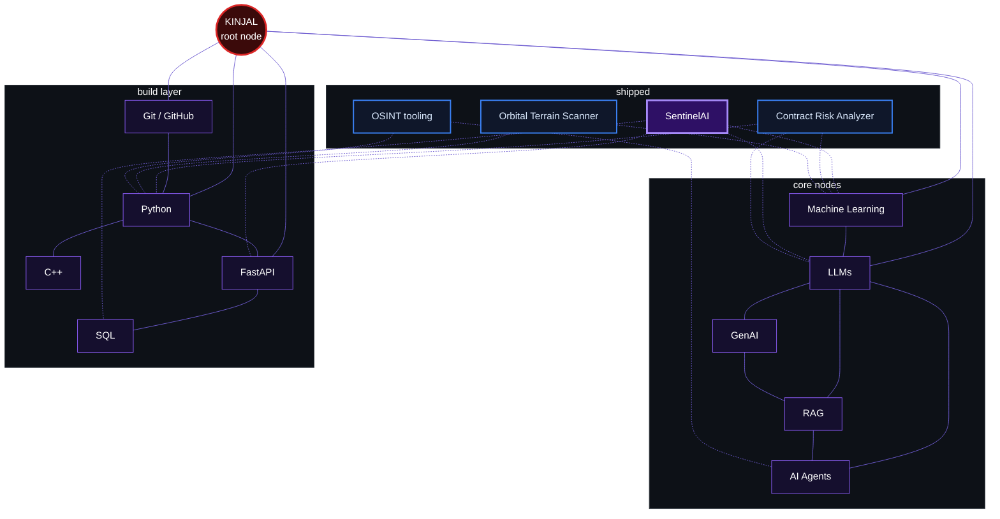

<div align="center">

</div>

<br/>

## > crawl.status

```text
identity   : CS student / AI-ML engineer in the making
mode       : building practical AI systems, in public
session    : AI/ML Intern @ a Bangalore-based startup
interests  : Machine Learning · LLMs · GenAI · RAG · AI Agents · Backend systems
learning   : DSA · ML engineering · production AI
contributes: open source
```


## > currently_crawling

| Target | Status | Why it matters |
|:--|:--|:--|
| ML engineering | `indexing` | Training is the easy part. Evaluation, deployment and monitoring are what make a model useful. |
| RAG + agents | `indexing` | Retrieval quality and tool use decide whether LLM apps are reliable. |
| DSA + C++ | `queued, daily` | Strong fundamentals keep every other layer fast and clean. |
| Open source | `crawling` | Reading real codebases and shipping fixes upstream. |


## > the_web

Every node is a skill, and every thread is a place I used it. The projects sit at the edge of the web, where the skills connect.



<div align="center">


</div>


## > featured_node: SentinelAI

<table>
<tr>
<td width="60%" valign="top">

**Production LLM quality-monitoring system.**

SentinelAI watches an LLM application in production and flags quality drift before users notice. Responses are embedded with TF-IDF and scored with **Isolation Forest** and **CUSUM** change detection. Anomalies trigger **Slack webhook** alerts.

`FastAPI` · `Supabase Postgres` · `Render` · `Isolation Forest` · `CUSUM` · `Slack alerts`

[**Repository**](https://github.com/KinjalGoswami68/YOUR_SENTINELAI_REPO) · [**Live demo**](YOUR_SENTINELAI_DEMO_URL)

</td>
<td width="40%" align="center" valign="middle">

<a href="https://github.com/KinjalGoswami68/YOUR_SENTINELAI_REPO">

</a>

</td>
</tr>
</table>


## > other_nodes

<table>
<tr>
<td width="50%" valign="top">

**Contract Risk Analyzer**

DistilBERT fine-tuned on the CUAD dataset to classify contract clauses across 34 risk categories (~75% accuracy). Llama 3.3 70B on Groq explains each flagged clause in plain English. The frontend is Streamlit.

`DistilBERT` · `CUAD` · `Groq` · `Streamlit`

[Repository](https://github.com/KinjalGoswami68/YOUR_CONTRACT_RISK_REPO)

</td>
<td width="50%" valign="top">

**Orbital Terrain Scanner**

[1-2 lines: what it scans, what data or imagery it uses, and what it outputs.]

`[tech]` · `[tech]` · `[tech]`

[Repository](https://github.com/KinjalGoswami68/YOUR_ORBITAL_REPO)

</td>
</tr>
<tr>
<td width="50%" valign="top">

**OSINT tooling**

[1-2 lines: what it collects, how it processes the data, what problem it solves.]

`[tech]` · `[tech]` · `[tech]`

[Repository](https://github.com/KinjalGoswami68/YOUR_OSINT_REPO)

</td>
<td width="50%" valign="top">

**More threads**

Smaller experiments, notebooks and builds live in my repositories.

[Browse all repositories](https://github.com/KinjalGoswami68?tab=repositories)

</td>
</tr>
</table>


## > active_session

```text
$ crawl --session active

role    : AI/ML Intern
org     : YOUR_STARTUP_NAME · Bangalore, India
focus   : [what you build there: LLM features, RAG pipelines, agents, backend APIs]
stack   : [Python · FastAPI · ... edit to match]
status  : in progress
```

## > open_source_threads

| Repository | Contribution | Status |
|:--|:--|:--|
| [arkorlab/arkor](https://github.com/arkorlab/arkor/pull/212) | PR #212, a port-fallback fix in the CLI | `merged` |
| [YOUR_ORG/YOUR_REPO](https://github.com/YOUR_ORG/YOUR_REPO) | [short description] | `open` |


## > telemetry

<div align="center">


</div>


## > frontier_nodes

```text
[queued]  LLM evaluation + observability     (taking SentinelAI further)
[queued]  Agent workflows and tool use
[queued]  Retrieval quality in RAG systems
[daily ]  DSA practice in C++ and Python
[queued]  GSoC 2027 preparation
```

## > open_connection

<div align="center">

<a href="https://www.linkedin.com/in/YOUR_LINKEDIN"></a>
<a href="https://x.com/KGoswami70"></a>
<a href="mailto:YOUR_EMAIL"></a>
<a href="YOUR_PORTFOLIO_URL"></a>

</div>


```text
kinjal@web:~$ ./crawl --status
[ok] connection closed. the web stays alive and the spider keeps crawling.
```